# 石头剪刀布游戏部署及操作文档
## 部署
(1) 第一步、下载程序所需要的依赖
```
npm install
```
(2) 第二步、本地运行检验程序所需要的依赖是否全部下载完成
```
npm run serve  
```
(3) 第三步、进行打包前端文件生成dist文件夹
```
npm run build
```
(4) 第四步、将dist文件夹放到服务器上准备好的目录中

(5) 第五步、更改nginx配置文件
> 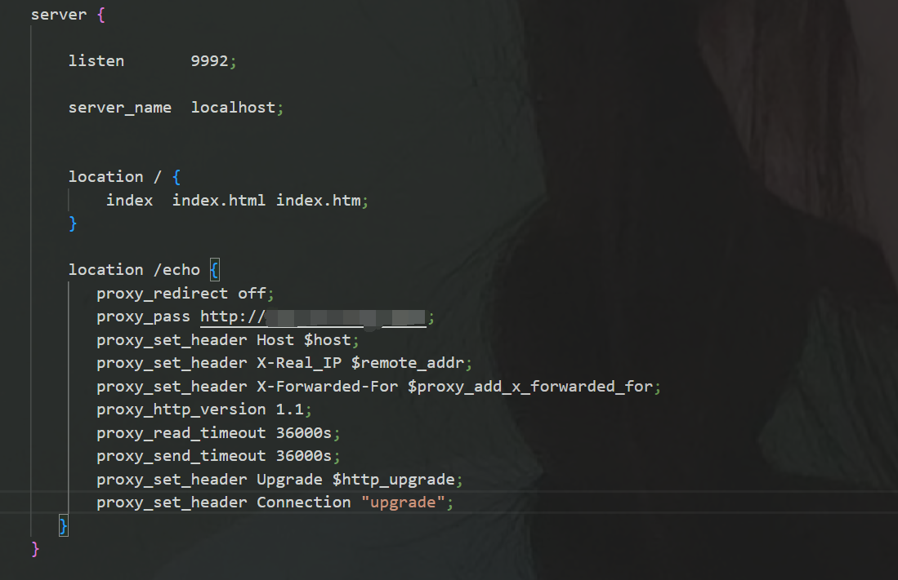

(6) 第六步、在浏览器输入配置好的IP地址及端口进行访问即可
## 操作文档
#### 本游戏为两人在线游戏，需要两名玩家同时进行
(1) 创建房间，由第一名玩家创建房间，在页面中点击创建房间，输入房间号，点击创建既可以，其余玩家通过房间号加入房间。
> 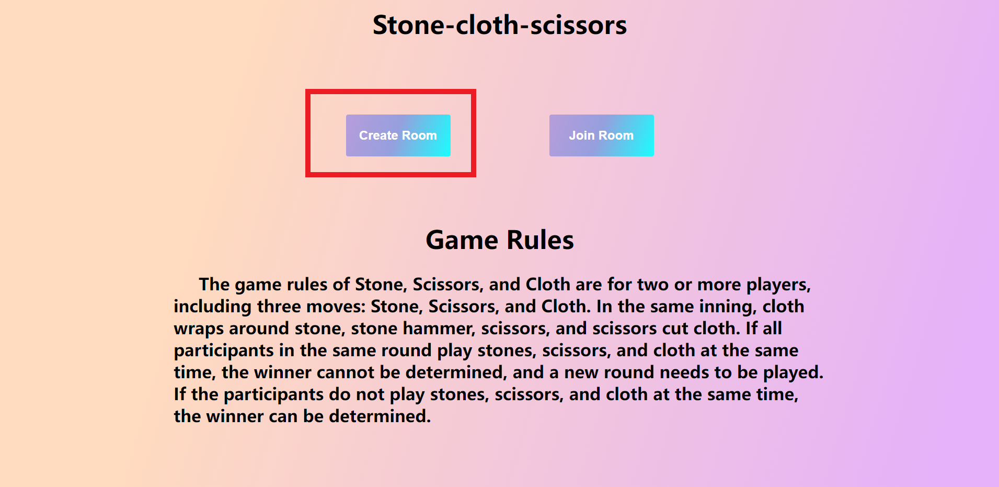
> 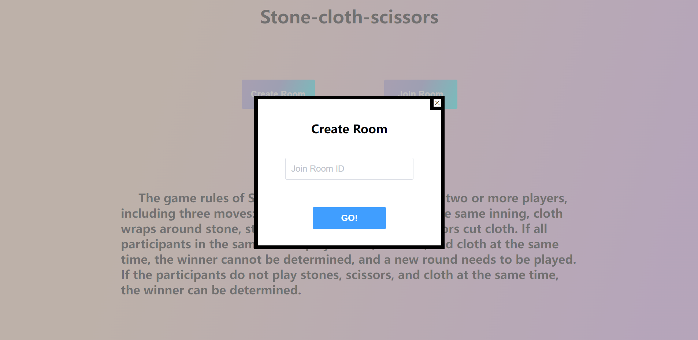
(2) 创建完房间之后，若没有玩家加入，则进入等待对手界面。
> 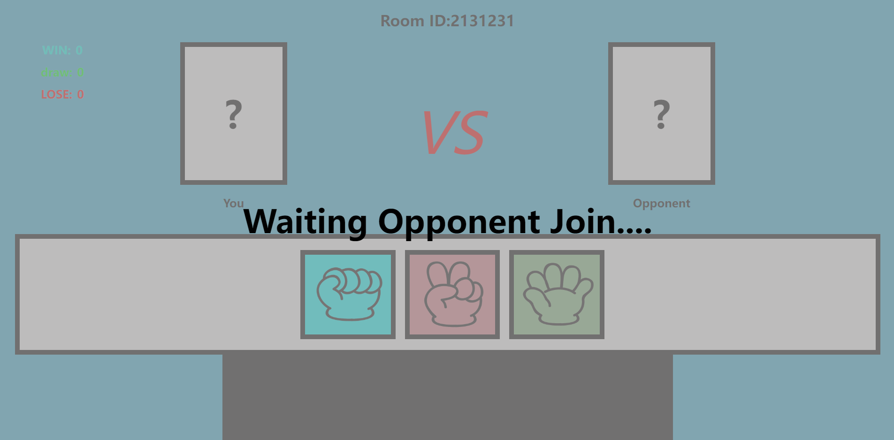
(3) 加入房间，由第二名玩家通过第一名玩家创建的房间号加入游戏，在页面中点击加入房间，输入房间号，点击加入既可以。若房间中已经存在两人，则不可以进入房间。
> 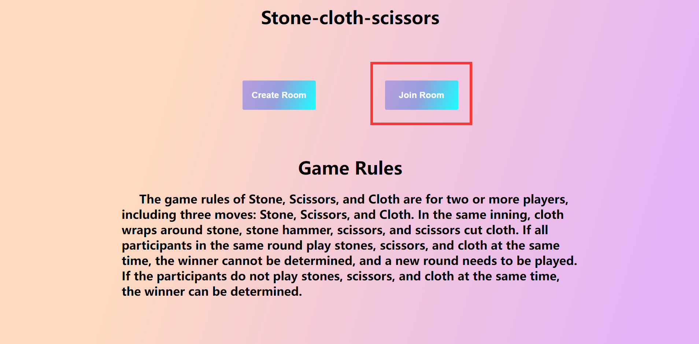
> 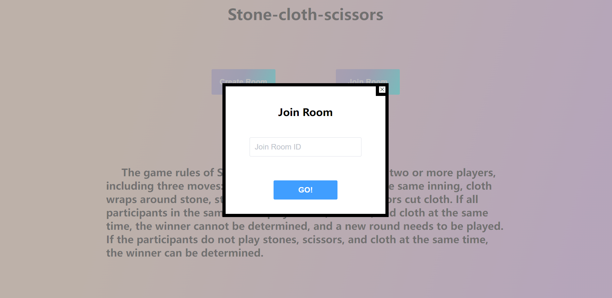
(4) 玩家全部进入之后，及玩家可以进行出拳。
> 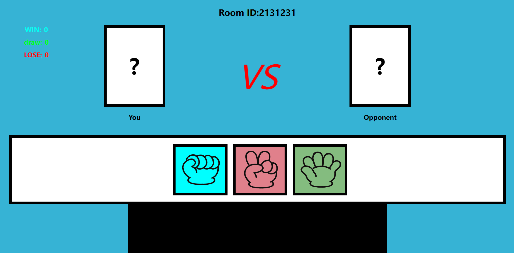
(5) 玩家一出拳后，若玩家二没有出拳，则进入等待对手出拳界面。
> 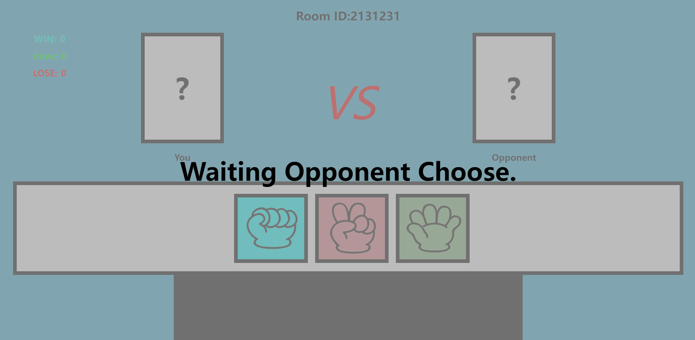
(5) 双方玩家都出拳之后，系统会根据玩家出拳进行对比，判断谁输输赢。
> 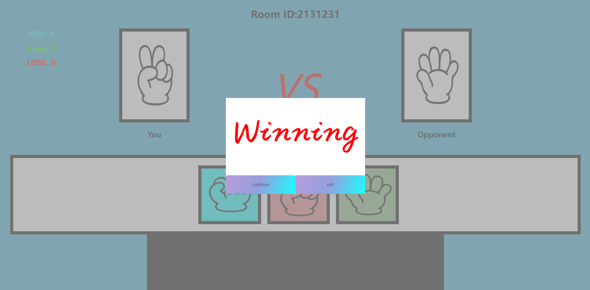
(6) 第一场比赛结束，若玩家还想继续，则点击"继续"按钮,若想和其他玩家进行游戏，点击"退出"按钮，重新创建房间。
> 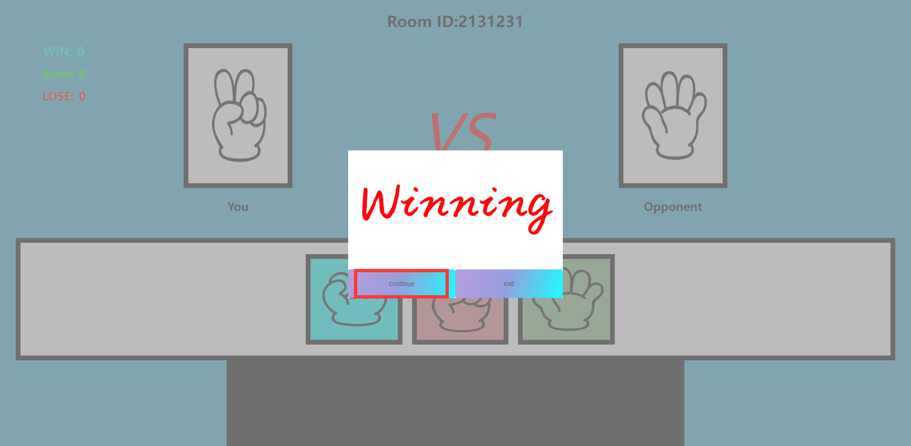
> 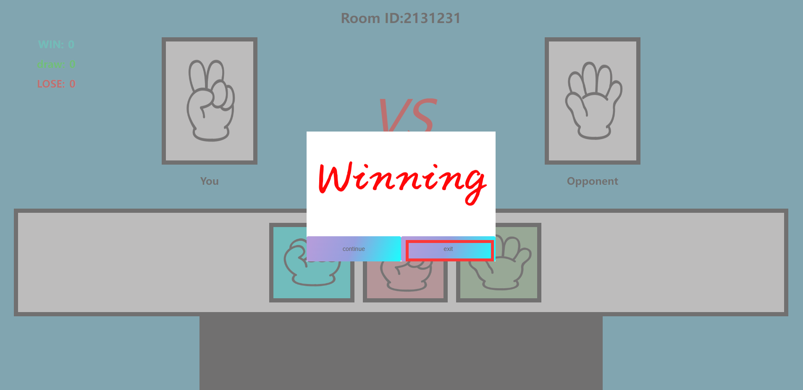